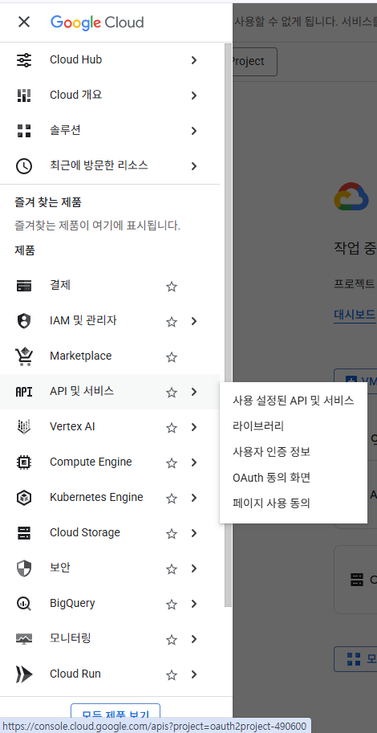
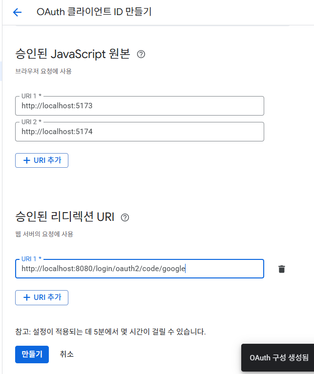
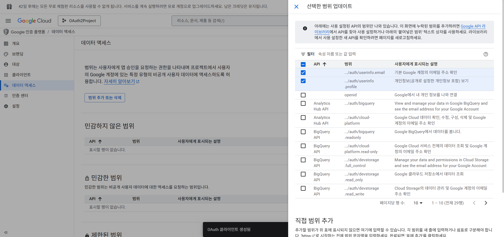

# 입실 체크 해주세요 !! 🚔

# OAuth2 구현
1. OAuth2란 ?
    - Open Authorization 2.0의 축약어로 사용자의 비밀번호를 직접 받지 않고 구글/카카오와 같은 외부 서비스를 통해 사용자를 인증(Authentication)하는 표준 방법.

    - 깃허브 로그인할 때 구글 계정으로 로그인 버튼 눌렀을 때 일어나는 과정을 생각하시면 되겠습니다.

    - 근데 생각해보면 sign up(회원 가입)할 때는 결국 username/email 쓰고 비밀번호 입력하기는 했습니다. 그렇다면 회원 정보가 웹 사이트의 DB에 이미 존재하기는 하는데 로그인은 구글로 한다고 볼 수 있겠네요.

2. 왜 필요한가 ?
    - 기존 방식의 경우 사용자가 사이트에 username / password를 입력하게 되면 서버가 구글에 대신 로그인을 해줍니다 -> 그러면 사용자 비밀번호가 서버에 노출되는 형태.

    - OAuth2 방식의 경우 구글 로그인 페이지에서 구글에 로그인을 시도하고 -> 서버는 _ 허가 코드_ 를 받습니다. -> 그리고 이 허가 코드를 통해서 사용자 정보를 받아오게 되기 때문에 : 구글만 구글 비밀 번호를 확인할 수 있습니다.


- 이상에서 중요한 점은,
  1. 사용자는 구글 페이지에서 직접 로그인합니다.
  2. 구글은 Authorization Code를 주고, 이를 통해서 Access Token을 받게 됩니다.
  3. Access Token으로 구글 API에서 사용자 정보를 받아온 후에,
  4. 웹 사이트의 서버는 해당 사용자 정보와 일치하는 것을 발견한 후 웹 사이트의 JWT를 발급해서 프론트로 전달합니다.

## Backend 파트 작성
1. 어제 작성한 버전에서 default 검색이 되지 않는 의존성 추가하겠습니다.
```java
	implementation 'io.jsonwebtoken:jjwt-api:0.13.0'
	runtimeOnly 'io.jsonwebtoken:jjwt-impl:0.13.0'
	runtimeOnly 'io.jsonwebtoken:jjwt-jackson:0.13.0'
```
2. chrome에서 gcp 검색 -> google cloud platform의 축약어 : gemini API key 발급받을 때 프로젝트 하나 생성했었다고 수업했습니다. -> OAuth2Project라고 이름지어놨습니다.
3. 좌측 메뉴바 클릭 -> API 및 서비스 -> OAuth 동의 화면 클릭


승인된 리디렉션 URI 
`http://localhost:8080/login/oauth2/code/google`



```json

```

2. 데이터 범위(Scope 설정)



3. application.properties 작성

- jwt 예시 : mySecretKeyForJwtTokenGenerationMustBe256BitsLong1234567890