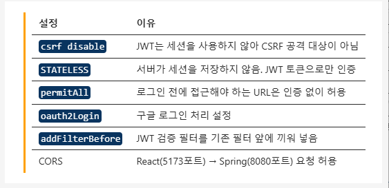

# 입실 체크 해주세요 !! 🎈

# OAuth2 Backend 작성
## SecurityConfig 작성
- config package에 SecurityConfig.java 파일 생성
- application.properties에 client id / secret 다시 집어넣겠습니다.



## Controller 작성

이후에 어디 부분까지 테스트가 가능했는지, 왜 가능한지 등을 체크하셔야 합니다.

# OAuth2 Frontend 작성
```bash
npm install @emotion/react@11.11.1 @emotion/styled@11.11.0 @mui/material@5.14.8 @mui/x-data-grid@6.20.4 @tanstack/react-query@4.43.0 axios@1.13.6 react-router-dom
```